<a name="Top"/>


\newpage

# Disclaimer
The data were downloaded from NCBI's SRA or from EBI's ArrayExpress. See the following disclaimers for copyright / license policies.  
* [International Nucleotide Sequence Database Collaboration Policy](http://www.insdc.org/policy.html)  
* [GEO Disclaimer](https://www.ncbi.nlm.nih.gov/geo/info/disclaimer.html)  

[Top](#Top)

\newpage


# Background

## Chemistry
* The **unified atomic mass unit** or **dalton** (symbol: **_u_**, or **_Da_**) is a standard unit of mass that quantifies mass on an atomic or molecular scale (atomic mass). One unified atomic mass unit is approximately the mass of one nucleon (either a single proton or neutron) and is numerically equivalent to 1 g/mol.  
* Nuclear Notation


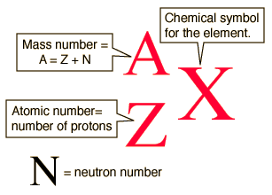
  
**Figure 1: Nuclear Notation.** Standard nuclear notation shows the chemical symbol, the mass number and the atomic number of the isotope.  


* Isotopes


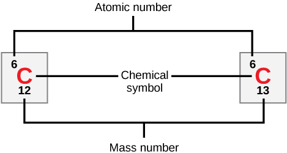
  
**Figure 2: Isotopes** The different isotopes of a given element have the same atomic number but different mass numbers since they have different numbers of neutrons. E.g., <sup>12</sup>C<sub>6</sub> and <sup>13</sup>C<sub>6</sub>


## Biochemistry


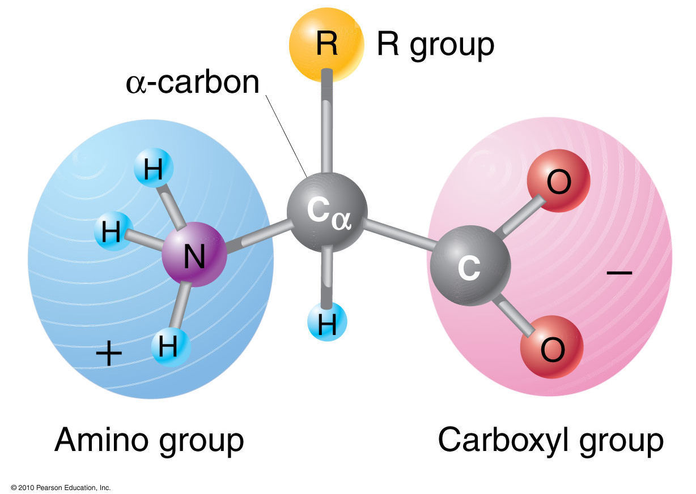
  
**Figure 3: Stereoisometry of Amino Acids.** The four bonds of the central or alpha carbon (C$\alpha$) of an amino acid are directed towards the four corners of a tetrahedron. With respect to the carboxyl (COO<sup>-</sup>) and amino (NH3<sup>+</sup>)groups, there are two possible arrangements of the H and **Radical group**.  These arrangement are literally mirror images of each other, and are called stereoisomers (AKA enantiomers). Stereoisomers are designated D (dextro-rotatory) or L (levo-rotatory) according to the direction in which the crystalline forms rotate polarized light, to the right and left, respectively. Naturally-occuring amino acids are exclusively of the L form.  


  
**Figure 4: Amino Acid Chart.**   

[Top](#Top)


# Introduction

Since the development of the first modern mass spectrometer in 1918 [@dempster_new_1918], the technique has advanced steadily over time and found its’ way into a range of applications from forensic toxicology to cancer diagnostics. **Quantitative proteomics** is a powerful approach used for both discovery and targeted proteomic analyses to understand global proteomic dynamics in a cell, tissue or organism.  


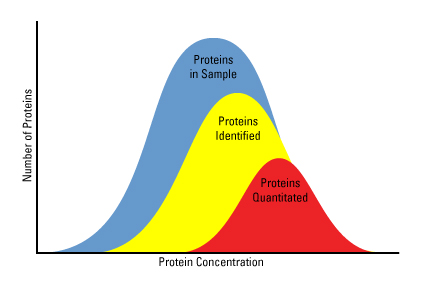
  
**Figure 5: Protein abundance and sample complexity.** Protein abundance and sample complexity are significant factors that affect the availability of proteins for mass spectrometric quantitation. [@bantscheff_quantitative_2007]  


Most quantitative proteomic analyses entail the isotopic labeling of proteins or peptides in the experimental groups, which can then be differentiated by mass spectrometry. Relative quantitation methods (**Stable isotope labeling with amino acids in cell culture (SILAC)**, **Isotope-coded affinity tag (ICAT)**, **Isotope-coded protein label (ICPL)** and isobaric tags (e.g., **iTRAQ**)) are used to compare protein or peptide abundance between samples, while **spiking unlabeled samples with known concentrations of isotopically-labeled synthetic peptides** can yield absolute quantitation of target peptides via selected reaction monitoring (SRM).  

**Label-free strategies** are also available for both relative and absolute quantitation.  
Although these strategies are more complex than mere protein identification, quantitative proteomics is critical for our understanding of global protein expression and modifications underlying the molecular mechanisms of biological processes and disease states.


## Quantitative Approaches

- Mass spectrometry vs. Tandem MS (MS/MS)
    + Intensity based: (MS<sup>1</sup>)
    + Spectral Counting: (MS<sup>2</sup> = MS/MS)


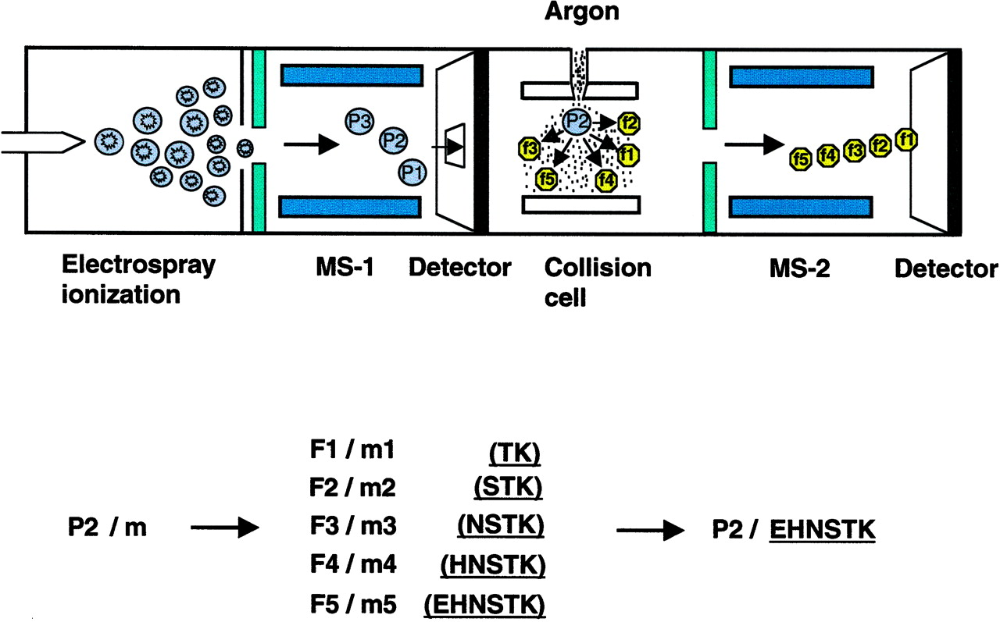
  
**Figure 6: Tandem mass spectrometry.** Tandem mass spectrometry, also known as MS/MS or MS2, involves multiple steps of mass spectrometry selection, with some form of fragmentation occurring in between the stages. In a tandem mass spectrometer, ions are formed in the ion source and separated by **mass-to-charge ratio** in the first stage of mass spectrometry (**MS<sup>1</sup>**). Ions of a particular mass-to-charge ratio (precursor ions) are selected and fragment ions (product ions) are created by **collision-induced dissociation**, ion-molecule reaction, photodissociation, or other process. The resulting ions are then separated and detected in a second stage of mass spectrometry (**MS<sup>2</sup>**).  


- Liquid chromatography – (tandem) mass spectrometry (LC-MS(/MS))


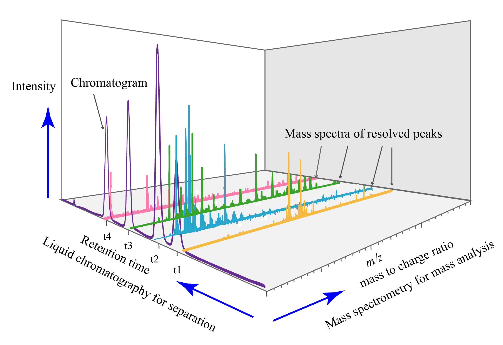
  
**Figure 7: LC-MS Spectrum.**  **N.B., Most scans (Retention time-axis) don't have any signal, once starting to receive signal, continues scans should have signals around specific m/z ratio.**


### Labeling versus Label-Free

- labeling approaches
    + Metabolic: **SILAC** [@ong_stable_2002]
    + Enzymatic: <sup>16</sup>O to <sup>18</sup>O
    + Chemical
        - **ICAT** [@gygi_quantitative_1999]: <sup>1</sup>H to <sup>2</sup>H/D
        - **iTRAQ** [@ross_multiplexed_2004]/**TMT** [@andrew_thompson_tandem_2003] (followed by Spectral based MS/MS): <sup>12</sup>C<sub>6</sub> to <sup>13</sup>C<sub>6</sub>, <sup>14</sup>N<sub>7</sub> to <sup>15</sup>N<sub>7</sub>, <sup>16</sup>O<sub>8</sub> to <sup>18</sup>O<sub>8</sub>
    + Cons: Most label-based quantification approaches have potential limitations:
        - **complex sample preparation**,
        - **the requirement for increased sample concentration**,
        - and **incomplete labeling**. [@patel_comparison_2009]
- label-free (unlabeled) approaches [@panchaud_experimental_2008]
    + Nonlabeled techniques which have been (first) developed include peptide match score summation (**PMSS**) [@allet_vitro_2004] and spectrum sampling (**SpS**) [@liu_model_2004], both of which can be combined with statistical evaluation to detect differentially expressed proteins [@colinge_differential_2005]. Another approach utilizes a protein abundance indices (**PAIs**) [@rappsilber_large-scale_2002], which can be converted to exponentially modified PAI (**emPAI**) for absolute protein quantification [@ishihama_exponentially_2005].
    + PMSS [@allet_vitro_2004]
        - The method is based on **the assumption that a protein score is a sum of identification scores of its peptides and that a high protein score is correlated with a higher abundance**, thus yielding semi-quantitative information.
    + SpS [@liu_model_2004]
        - A very similar approach to PMSS relies on the counting of spectra identifying a protein.
    + PAIs [@rappsilber_large-scale_2002]
        - Another method to PMSS/SpS is believed to be more reliable as they are based on observable parameters.
    + emPAI [@ishihama_exponentially_2005]
        - An improved method of PAI by introducing the observed logarithmic relationship between the number of peptides observed and the protein amount within given sample.


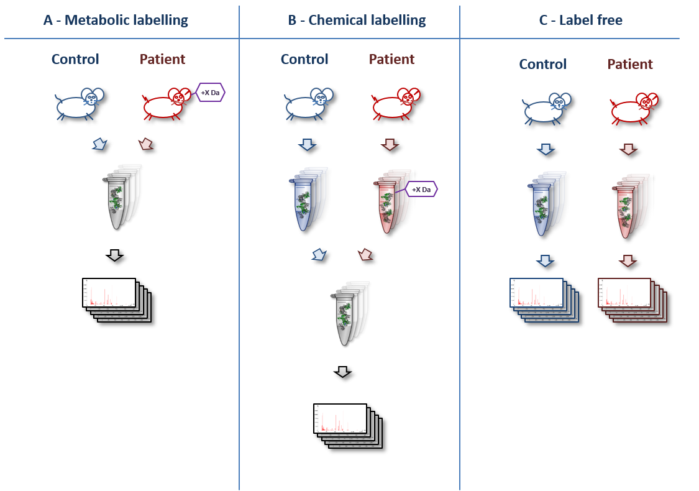
  
**Figure 8: A basic overview of various quantitation techniques.** Label-free methods for quantitation are popular in the proteomics community and may be the most straight-forward laboratory technique in the field. However, labelled approaches have some benefits, which make them the method-of-choice for some scientific questions or experimental designs. [@noauthor_galaxy_nodate]  


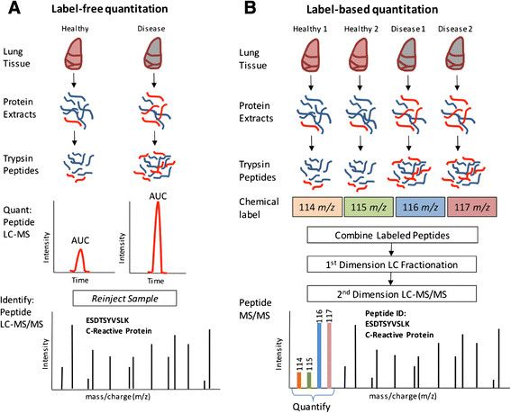
  
**Figure 9: Principles of quantitative proteomics.** **A)** Label-free quantitation performed by peptide peak area under the curve. Proteins are extracted from tissue, proteolytically digested into peptides and analyzed by liquid chromatography (LC)-MS. Analyte intensity versus retention time profiles are generated from which area under the curve (AUC) or summed peak intensities are calculated. Relative peptide amount in healthy versus disease sample is proportional to peak AUC or summed intensities. Targeted peptide identification is typically performed on a subsequent injection. **B)** Label-based quantitation with the iTRAQ (isotope tagging for relative and absolute quantitation) 4plex workflow. Proteins from four individual samples are digested into peptides that are tagged with isobaric stable isotope labeled chemicals. Four chemical tags have 4 unique mass-to-charge (m/z) values that are produced during peptide tandem MS (MS/MS) and used for relative quantitation by relative peak intensity. Peptide fragment ions are used for peptide ID and protein inference.. [@bhargava_application_2014] **N.B., In Figure A, a specific m/z ratio was set/selected to draw the curve in Quant: Peptide LC-MS.**  


<a name="AlnStat"/>

<table class="table table-striped table-hover table-condensed table-responsive table" style="margin-left: auto; margin-right: auto; width: auto !important; margin-left: auto; margin-right: auto;">
<caption>(\#tab:unnamed-chunk-11)Pros and Cons of Label-free and Labelled Quantitation Methods</caption>
 <thead>
  <tr>
   <th style="text-align:center;-webkit-transform: rotate(0deg); -moz-transform: rotate(0deg); -ms-transform: rotate(0deg); -o-transform: rotate(0deg); transform: rotate(0deg);"> category </th>
   <th style="text-align:center;-webkit-transform: rotate(0deg); -moz-transform: rotate(0deg); -ms-transform: rotate(0deg); -o-transform: rotate(0deg); transform: rotate(0deg);"> label-free </th>
   <th style="text-align:center;-webkit-transform: rotate(0deg); -moz-transform: rotate(0deg); -ms-transform: rotate(0deg); -o-transform: rotate(0deg); transform: rotate(0deg);"> labelled </th>
  </tr>
 </thead>
<tbody>
  <tr>
   <td style="text-align:center;"> machine time </td>
   <td style="text-align:center;"> more </td>
   <td style="text-align:center;"> less </td>
  </tr>
  <tr>
   <td style="text-align:center;"> wet lab complexity &amp; time </td>
   <td style="text-align:center;"> little </td>
   <td style="text-align:center;"> medium </td>
  </tr>
  <tr>
   <td style="text-align:center;"> comparability of samples </td>
   <td style="text-align:center;"> difficult </td>
   <td style="text-align:center;"> easy </td>
  </tr>
  <tr>
   <td style="text-align:center;"> data analysis </td>
   <td style="text-align:center;"> complex </td>
   <td style="text-align:center;"> complex </td>
  </tr>
  <tr>
   <td style="text-align:center;"> study design </td>
   <td style="text-align:center;"> flexible </td>
   <td style="text-align:center;"> fixed </td>
  </tr>
</tbody>
<tfoot>
<tr><td style="padding: 0; border: 0;" colspan="100%"><span style="font-style: italic;">Note: </span></td></tr>
<tr><td style="padding: 0; border: 0;" colspan="100%">
<sup></sup> Detailed Explanation:</td></tr>
<tr><td style="padding: 0; border: 0;" colspan="100%">
<sup>1</sup> Machine time: In label-free experiments, each sample is measured in a separate mass spectrometry (MS) run. In labelled experiments, samples of each condition are combined prior to the MS run. This cuts down the machine time needed by the complexity of the labelling technique (usually between 2 and 8 times less machine time).</td></tr>
<tr><td style="padding: 0; border: 0;" colspan="100%">
<sup>2</sup> Wet lab complexity &amp; time: While label-free samples can be measured without much preparation, all labelling techniques need additional pretreatments in the wet lab. The samples have to be labelled either metabolically (e.g. by SILAC) or chemically (e.g. iTRAQ or TMT) and the different conditions have to be combined. Thus, label-free techniques are less prone to wet lab errors than labelling techniques.</td></tr>
<tr><td style="padding: 0; border: 0;" colspan="100%">
<sup>3</sup> Comparability of samples: A drawback of the label-free approaches is that run conditions (e.g. temperature, experimenter, column condition) may differ between samples. Such differences do not occur in labelled experiments, because samples that are compared to each other are measured in the very same MS run. Therefore, label-free are more prone to errors introduced by the measurement conditions than labelled. Including a well-chosen standard in label-free experiments (e.g. a labelled control sample mixed to each sample prior to the MS run or the “Super-SILAC” approach) may reduce this problem, but has to be carefully planned in beforehand. A benefit of label free experiments is that any sample can be directly compared with any other, whereas in labelled experiments, you can typically only directly compare those samples that were physically mixed and measured in one run. A sample that is measured as a reference in each run of a labelled experiment can help to avoid this problem.</td></tr>
<tr><td style="padding: 0; border: 0;" colspan="100%">
<sup>4</sup> Data analysis: Data analysis of each type of experiment has it’s special pitfalls. In our opinion, the benefits and drawbacks need to be considered to strike the right balance.</td></tr>
<tr><td style="padding: 0; border: 0;" colspan="100%">
<sup>5</sup> Study design: Label-free approaches have the advantage of being very adaptable, even after having started the study. New samples may be included at any time. In contrast, labelled approaches need the same number (n) of each condition. New samples cannot be included into the study, if they cannot be physically mixed with and measured together with a control. Labelled techniques like the “Super-SILAC” approach do reduce this problem, but also need to be carefully planned in beforehand.</td></tr>
</tfoot>
</table>

<a name="AlnStat"/>

<table class="table table-striped table-hover table-condensed table-responsive table" style="margin-left: auto; margin-right: auto; width: auto !important; margin-left: auto; margin-right: auto;">
<caption>(\#tab:unnamed-chunk-13)A Mass Spec Timeline</caption>
 <thead>
  <tr>
   <th style="text-align:center;-webkit-transform: rotate(0deg); -moz-transform: rotate(0deg); -ms-transform: rotate(0deg); -o-transform: rotate(0deg); transform: rotate(0deg);">  </th>
   <th style="text-align:center;-webkit-transform: rotate(0deg); -moz-transform: rotate(0deg); -ms-transform: rotate(0deg); -o-transform: rotate(0deg); transform: rotate(0deg);"> Labeling </th>
   <th style="text-align:center;-webkit-transform: rotate(0deg); -moz-transform: rotate(0deg); -ms-transform: rotate(0deg); -o-transform: rotate(0deg); transform: rotate(0deg);">  </th>
   <th style="text-align:center;-webkit-transform: rotate(0deg); -moz-transform: rotate(0deg); -ms-transform: rotate(0deg); -o-transform: rotate(0deg); transform: rotate(0deg);"> Label-free </th>
   <th style="text-align:center;-webkit-transform: rotate(0deg); -moz-transform: rotate(0deg); -ms-transform: rotate(0deg); -o-transform: rotate(0deg); transform: rotate(0deg);">  </th>
  </tr>
 </thead>
<tbody>
  <tr>
   <td style="text-align:center;"> Year </td>
   <td style="text-align:center;"> Tech </td>
   <td style="text-align:center;"> MS Level </td>
   <td style="text-align:center;"> Tech </td>
   <td style="text-align:center;"> MS Level </td>
  </tr>
  <tr>
   <td style="text-align:center;"> 1899~1911 </td>
   <td style="text-align:center;"> 1st mass spectrometer </td>
   <td style="text-align:center;">  </td>
   <td style="text-align:center;">  </td>
   <td style="text-align:center;">  </td>
  </tr>
  <tr>
   <td style="text-align:center;"> 1918 </td>
   <td style="text-align:center;"> 1st modern mass spectrometer </td>
   <td style="text-align:center;">  </td>
   <td style="text-align:center;">  </td>
   <td style="text-align:center;">  </td>
  </tr>
  <tr>
   <td style="text-align:center;"> 1999 </td>
   <td style="text-align:center;"> ICAT </td>
   <td style="text-align:center;"> MS </td>
   <td style="text-align:center;">  </td>
   <td style="text-align:center;">  </td>
  </tr>
  <tr>
   <td style="text-align:center;"> 2002 </td>
   <td style="text-align:center;"> SILAC </td>
   <td style="text-align:center;"> Both </td>
   <td style="text-align:center;"> PAI </td>
   <td style="text-align:center;"> MS/MS </td>
  </tr>
  <tr>
   <td style="text-align:center;"> 2003 </td>
   <td style="text-align:center;"> TMT </td>
   <td style="text-align:center;"> MS/MS </td>
   <td style="text-align:center;">  </td>
   <td style="text-align:center;">  </td>
  </tr>
  <tr>
   <td style="text-align:center;"> 2004 </td>
   <td style="text-align:center;"> iTRAQ </td>
   <td style="text-align:center;"> MS/MS </td>
   <td style="text-align:center;"> PMSS/SpS </td>
   <td style="text-align:center;"> MS/MS </td>
  </tr>
  <tr>
   <td style="text-align:center;"> 2005 </td>
   <td style="text-align:center;">  </td>
   <td style="text-align:center;">  </td>
   <td style="text-align:center;"> emPAI </td>
   <td style="text-align:center;"> MS/MS </td>
  </tr>
</tbody>
</table>


### Labeling

* Reagent Kit / Protein labeling / Multiplexing
    - Treatment vs. control follwed by MS
        + **Stable isotope labeling with amino acids in cell culture (SILAC)**
            - use cell-culture enrichment with a stable isotope-labeled amino acid, including arginine/Arg/R, lysine/Lys/K, tyrosine/Tyr/Y, and leucine/Leu/L, for in vivo incorporation of a mass difference to support relative quantitation.
        + **Isotope-coded affinity tag (ICAT)**
            - <sup>1</sup>H to <sup>2</sup>H/D
    - Multiplexing follwed by MS/MS: **Isobaric tags** (TMT or iTRAQ) have identical masses and chemical properties that allow heavy and light isotopologues to co-elute together. The tags are then cleaved from the peptides by **collision-induced dissociation (CID)** during MS/MS, which is used for quantification.
        + **Isobaric tag for relative and absolute quantitation (iTRAQ)**
            - a multiplexed set of reagents for quantitative protein analysis that place isobaric mass labels **at the N termini and lysine/Lys/K side chains** of peptides in a digest mixture.
            - is a registered trademark of [SCIEX](https://sciex.com/products/consumables/itraq-reagent)
            - is available in **4-plex** and **8-plex** formats
        + **Tandem Mass Tag (TMT)**
            - is a registered trademark of Proteome Sciences PLC (licensing its Patented TMT Technology to [Thermo Fisher Scientific](https://www.thermofisher.com/us/en/home/life-science/protein-biology/protein-mass-spectrometry-analysis/protein-quantitation-mass-spectrometry/tandem-mass-tag-systems.html#/legacy=www.piercenet.com))
            - is available in **2**-plex, **6**-plex, and (since recently) **10**-plex formats


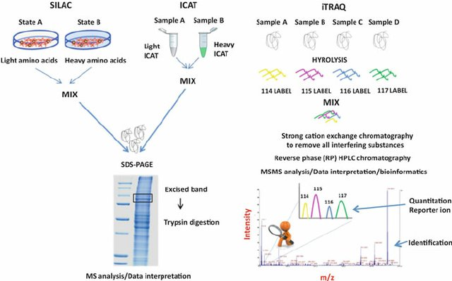
  
**Figure 10: Representative workflows for SILAC, ICAT, and iTRAQ.** The main differences among labeling techniques are (i) **SILAC** and **ICAT** labeling are applied on intact proteins, while **iTRAQ** labeling is performed on peptides, and (ii) in the case of **SILAC** and **ICAT**, peptides are quantified during MS analysis, while in the case of **iTRAQ**, quantitation occurs during fragmentation, i.e., MS/MS analysis. [@salvatore_oncoproteomic_2015]  


### Labeling::SILAC: stable isotope labeling with amino acids in cell culture

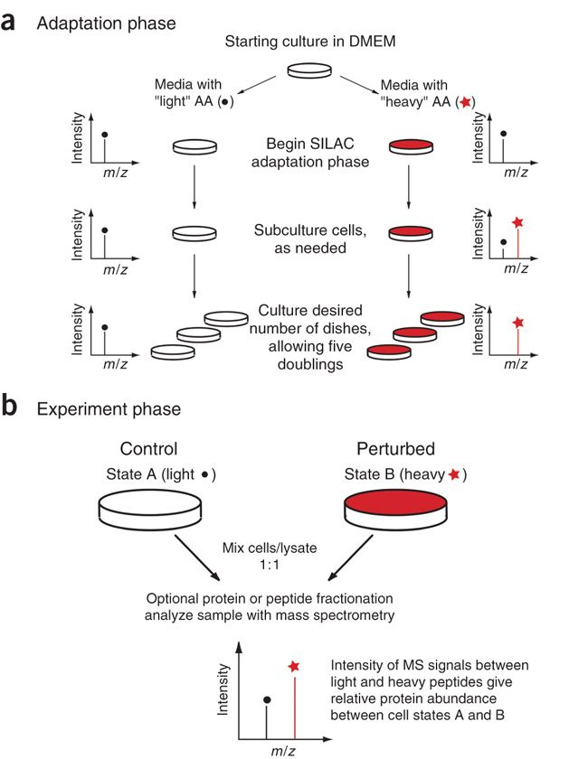
  
**Figure 11: Overview of SILAC protocol.** The SILAC experiment consists of two distinct phases — an adaptation (**a**) and an experimental (**b**) phase. (**a**) During the adaptation phase, cells are grown in light and heavy SILAC media until the heavy cells have fully incorporated the heavy amino acids (red star). This allows the two SILAC cell pools to be fully distinguishable by MS (black dot and red star, indicating light and heavy SILAC peptides, respectively) and can then be mixed and processed as a single sample. The adaptation phase can include the expansion of cells to reach the required number of dishes for the experiment. (**b**) In the second phase, the two cell populations are differentially treated, inducing changes in the proteome. The sample is mixed, a subproteome can be purified by an enrichment step or other fractionation, digested to peptides as a single pool and analyzed by MS for protein identification and quantification. [@ong_practical_2006]  


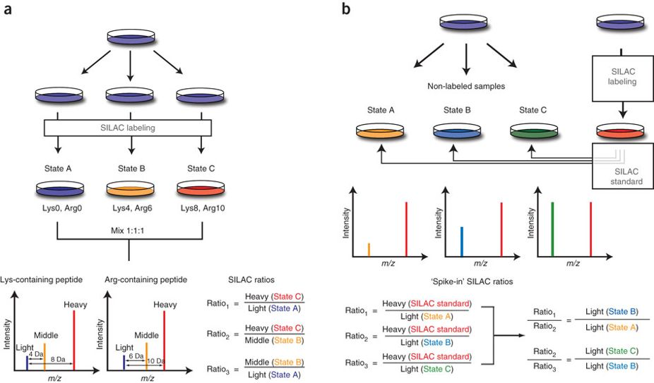
  
**Figure 12: The workflow of classical SILAC experiment versus spike-in SILAC standard.** (**a**) In the classical approach, two or three cell populations are labeled with heavy amino acids, then combined and analyzed together by LC-MS/MS. In the MS spectra, each peptide appears as a doublet or triplet with distinct mass differences. The ratios between the samples are calculated directly by comparing the differences in the intensities of the peaks. (**b**) With the spike-in SILAC standard, the labeling is separated or 'decoupled' from the biological experiment, which is then carried out under normal cell culture conditions. After the experiment is performed, the non-labeled samples are combined with the SILAC standard and each of these combined samples is analyzed separately by LC-MS/MS. The difference between the experimental samples is calculated as the 'ratio of ratios', where the ratio of one sample relative to the standard is divided by the ratio of the other relative to the standard. [@geiger_use_2011]  


### Labeling::iTRAQ: isobaric tag for relative and absolute quantitation

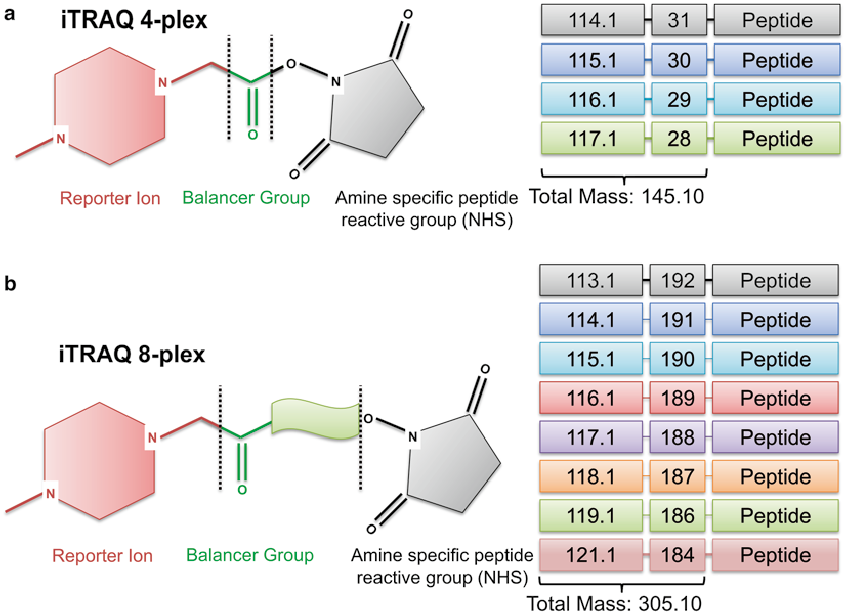
  
**Figure 13: Chemical structures for iTRAQ ( a ) 4-plex and ( b ) 8-plex isobaric tags.** Balancer + reporter ions add up to 145 Da in 4-plex and 304 Da in 8-plex experiments. In 8-plex, reporter mass of 120 is not present as it will give erroneous quantitation since phenylalanine immonium ion is also observed at a mass of 120 Da. [@aggarwal_dissecting_2016]  


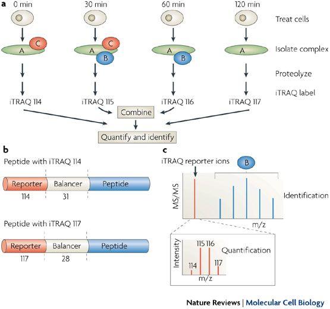
  
**Figure 14: Isobaric tags to elucidate complex formation dynamics.** **a** | Desired treatment of cells is followed by isolation of protein complexes and proteolysis. **Isobaric tags (iTRAQ)** are chemically added to the N terminus of every peptide (as well as to lysine $\epsilon$-amine groups). Samples from multiple treatment time points are combined and subjected to analysis. **b** | A peptide labelled with the iTRAQ 114 and iTRAQ 117 reagents. iTRAQ is isobaric, such that addition of the 114-Da or 117-Da mass tags alter the mass of a given peptide by the same amount. To maintain a constant mass, the reporter moiety (for example, of mass 114) is separated from the peptide by a balancer group. The reporter and balancer groups fragment in the collision cell of the mass spectrometer during the tandem mass spectrometry (MS/MS) event, and the intensity of the reporter ions is monitored. **c** | Analysis of an iTRAQ experiment. MS/MS analysis of a labelled peptide generates a fragmentation spectrum that yields the sequence of the peptide. The iTRAQ reagent is fragmented in the same step and reporter ions are quantified by magnifying the low mass range (114–117) area. In the example shown, protein B associates with protein A (the bait) after 30 and 60 minutes of stimulation, but not after 120 minutes of treatment. m/z, mass/charge ratio. [@gingras_analysis_2007]  


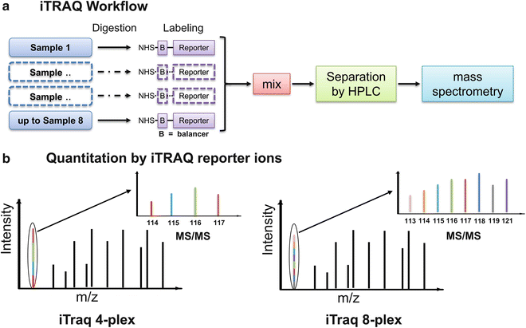
  
**Figure 15: iTRAQ Workflow.** **(a)** Basic iTRAQ workflow in which up to eight samples can be separately digested and labeled with iTRAQ tags, mixed together, separated by HPLC (high-performance liquid chromatography), and analyzed by mass spectrometer. **(b)** During MS/MS, the reporter ions of differential masses are released from peptide to give sample-specific quantitation of a particular peptide [@aggarwal_dissecting_2016]  


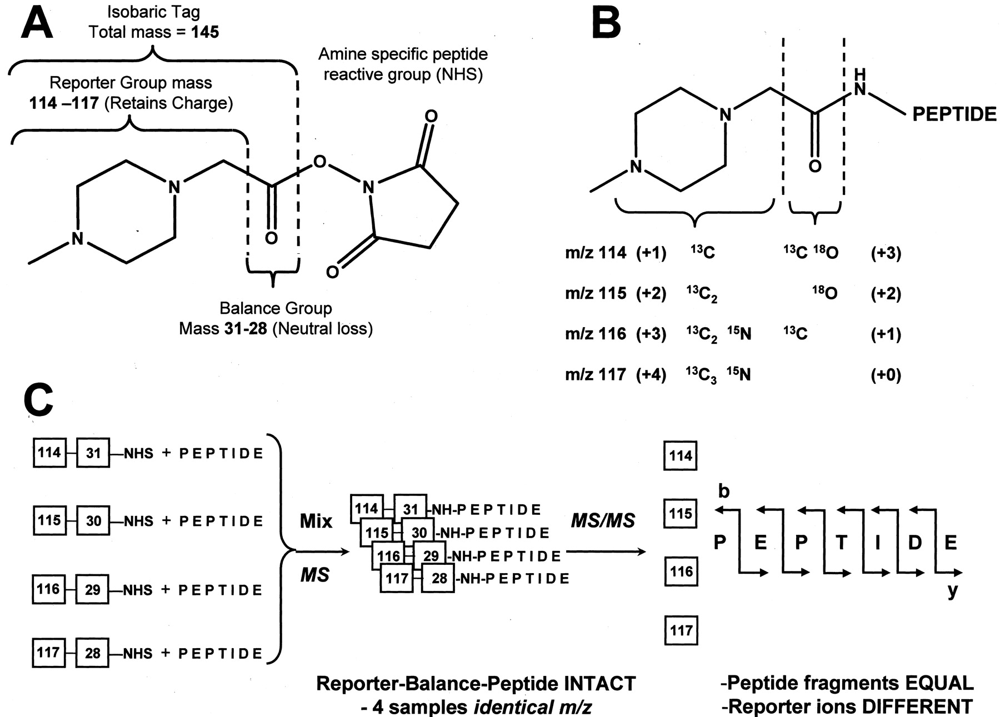
  
**Figure 16: Features of Multiplexed Tagging Chemistry.** **_A_**, diagram showing the components of the multiplexed isobaric tagging chemistry. The complete molecule consists of a reporter group (based on N-methylpiperazine), a mass balance group (carbonyl), and a peptide-reactive group (NHS ester). The overall mass of reporter and balance components of the molecule are kept constant using differential isotopic enrichment with **<sup>13</sup>C, <sup>15</sup>N, and <sup>18</sup>O** atoms (B), thus avoiding problems with chromatographic separation seen with enrichment involving deuterium substitution. The number and position of enriched centers in the ring has no effect on chromatographic or MS behavior. The reporter group ranges in mass from m/z 114.1 to 117.1, while the balance group ranges in mass from 28 to 31 Da, such that the combined mass remains constant (145.1 Da) for each of the four reagents. **_B_**, when reacted with a peptide, the tag forms an amide linkage to any peptide amine (N-terminal or $\epsilon$ amino group of lysine/Lys/K). These amide linkages fragment in a similar fashion to backbone peptide bonds when subjected to CID. Following fragmentation of the tag amide bond, however, the balance (carbonyl) moiety is lost (neutral loss), while charge is retained by the reporter group fragment. The numbers in parentheses indicate the number of enriched centers in each section of the molecule. **_C_**, illustration of the isotopic tagging used to arrive at four isobaric combinations with four different reporter group masses. A mixture of four identical peptides each labeled with one member of the multiplex set appears as a single, unresolved precursor ion in MS (identical m/z). Following CID, the four reporter group ions appear as distinct masses (114–117 Da). All other sequence-informative fragment ions (b-, y-, etc.) remain isobaric, and their individual ion current signals (signal intensities) are additive. This remains the case even for those tryptic peptides that are labeled at both the N terminus and lysine/Lys/K side chains, and those peptides containing internal lysine/Lys/K residues due to incomplete cleavage with **trypsin (Solution Stable Enzyme for Mass Spectrometry)**. The relative concentration of the peptides is thus deduced from the relative intensities of the corresponding reporter ions. In contrast to **Isotope-coded affinity tag (ICAT)** and similar mass-difference labeling strategies, **_quantitation is thus performed at the MS/MS stage rather than in MS_**. [@ross_multiplexed_2004]  


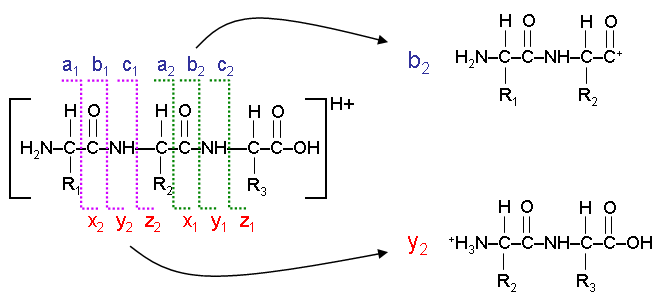
  
**Figure 17: Peptide Sequence Fragmentation.** Fragmentation of peptides (amino acid chains) typically occurs along the peptide backbone. Each residue of the peptide chain successively fragments off, both in the N->C and C->N direction. The location that the fragmentation occurs, and the nature of the ion remaining results in various ions, a, b, c and x, y, or z ions. The most commonly observed ions are a, b, and y ions. The following diagram illustrates the formation of b and y ions during the fragmentation of a three residue peptide chain. [Resource](http://www.alchemistmatt.com/mwthelp/peptidefragmodelling.htm)  


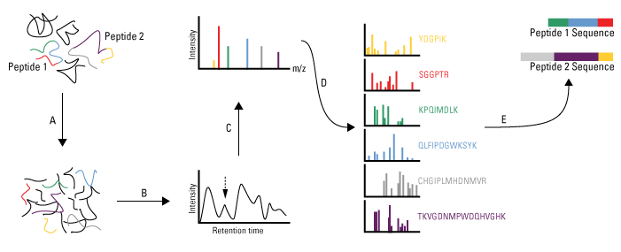
  
**Figure 18: Overview of proteomic analysis by MS/MS.** Sample proteins are extracted and digested into peptides (A). The sample complexity may then be reduced prior to chemical separation by LC (B). Fractions (indicated by dotted arrow) are then analyzed by MS (C), during which the peptides are ionized and their mass-to-charge ratio (m/z) measured to yield a precursor ion spectrum. Selected ions are then fragmented by collision-induced dissociation (CID) and the individual fragment ions measured by MS (D). The fragment ion spectra are then assigned peptide sequences based on database comparison and protein sequences are predicted (E). [Thermo Fisher](https://www.thermofisher.com/us/en/home/life-science/protein-biology/protein-biology-learning-center/protein-biology-resource-library/pierce-protein-methods/quantitative-proteomics.html)  


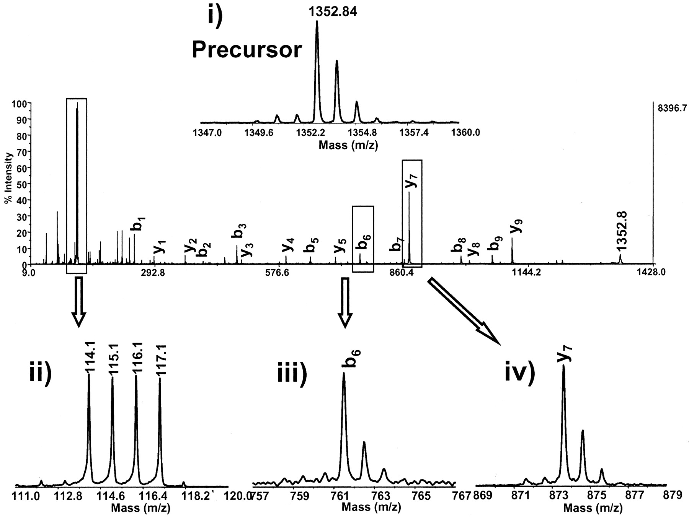
  
**Figure 19: Example MS/MS spectrum of peptide TPHPALTEAK from a protein digest mixture prepared by labeling four separate digests with each of the four isobaric reagents and combining the reaction mixtures in a 1:1:1:1 ratio.** Components of the spectrum illustrated are (i) isotopic distribution of the precursor ([M+H]+, **_m/z_** 1352.84), (ii) low mass region showing the signature ions used for quantitation, (iii) isotopic distribution of the b6 fragment, and (iv) isotopic distribution of the y7 fragment ion. The peptide is labeled by isobaric tags at both the N terminus and C-terminal lysine/Lys/K side chain. The precursor ion and all the internal fragment ions (e.g. type b- and y-) therefore contain all four members of the tag set, but remain isobaric. The example shown is the spectrum obtained from the singly charged [M+H]+ peptide using a 4700 MALDI TOF-TOF analyzer, but the same holds true for any multiply charged peptide analyzed with an ESI-source mass spectrometer. [@ross_multiplexed_2004]  

[Top](#Top)


# Computation


## Organization

* HUPO-PSI 
    + The **[Proteomics Standards Initiative (PSI)](http://www.psidev.info)** is a part of the **Human Proteome Organisation (HUPO)**
    + The **[PSI-MSS](http://www.psidev.info/groups/mass-spectrometry)** working group defines community data formats and controlled vocabulary terms facilitating data exchange and archiving in the the field of proteomics mass spectrometry.
* ISB-SPC 
    + **[Seattle Proteome Center (SPC)](http://tools.proteomecenter.org/software.php)** at the **Institute for Systems Biology (ISB)**  


## Data Format

* [Wiki](https://en.wikipedia.org/wiki/Mass_spectrometry_data_format)
* mzData was the first attempt by the Proteomics Standards Initiative (PSI) from the Human Proteome Organization (HUPO) to create a standardized format for Mass Spectrometry data. **This format is now deprecated, and replaced by __mzML__**.
* [mzXML](http://tools.proteomecenter.org/wiki/index.php?title=Formats:mzXML) by ISB-SPC
    + an open data format for storage and exchange of mass spectroscopy data, developed at the Seattle Proteome Center (SPC)/Institute for Systems Biology. mzXML provides a standard container for ms and ms/ms proteomics data and is the foundation of our proteomic pipelines. Raw, proprietary file formats from most vendors can be converted to the open mzXML format.
* [mzML](http://www.psidev.info/mzML) by HUPO-PSI = mzData (by PSI) + mzXML (by SPC)
    + The mzML format, which merges the mzData format and another similar format mzXML.
    + mzML 1.1.0 was released on June 1, 2009 and has been stable since then.  


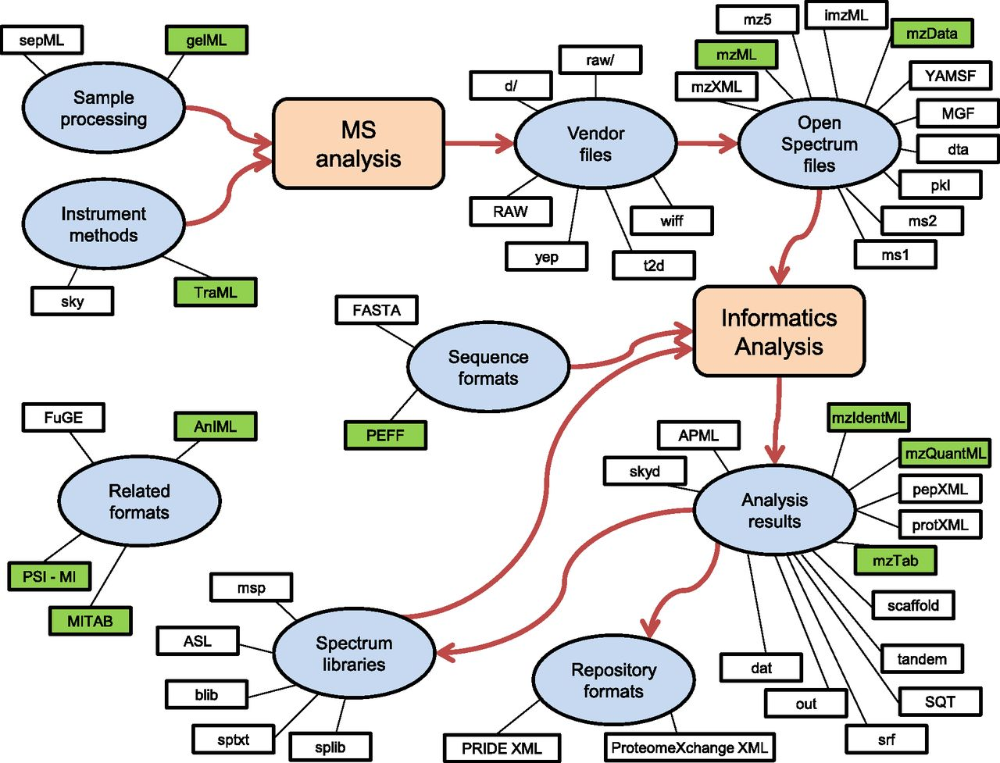
  
**Figure 20: Overview graph of the mass spectrometry proteomics formats.** The overall workflow of MS proteomics is depicted by the large shapes and the arrows connecting them. Ovals represent the major data types within the workflow. The small rectangles represent the individual file formats associated by an edge to their general data type. Shaded formats are officially approved or soon-to-be-approved standards. Different formats associated with the same data type are not necessarily redundant or equivalent. [@deutsch_file_2012]  


## Data Repository

* [ProteomeXchange Consortium](http://www.proteomexchange.org/)
    - The **ProteomeXchange Consortium** was established to provide globally coordinated standard data submission and dissemination pipelines involving the main proteomics repositories, and to encourage open data policies in the field.
    - Publications
        + ProteomeXchange provides globally coordinated proteomics data submission and dissemination [@vizcaino_proteomexchange_2014]
        + The ProteomeXchange consortium in 2017: supporting the cultural change in proteomics public data deposition [@deutsch_proteomexchange_2017]
    - Members & Sumbission Summary


<br />
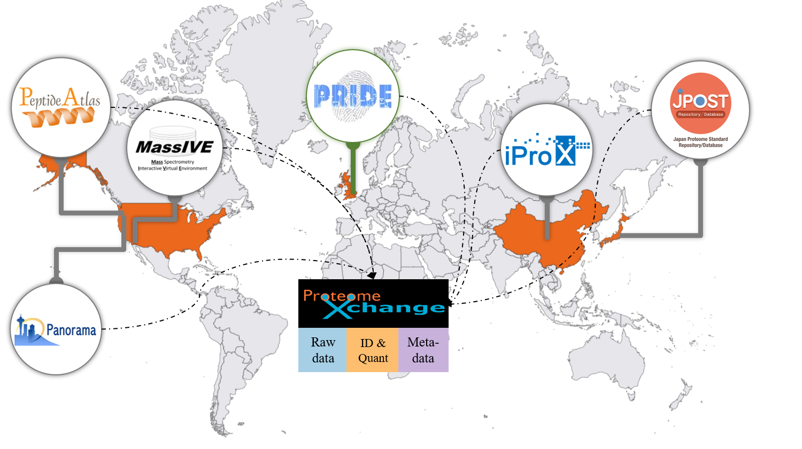
  
**Figure 21: Members in ProteomeXchange** The current members of the Consortium are: **PRIDE (EMBL-EBI, Cambridge, UK)**, **PeptideAtlas (ISB, Seattle, WA, USA)** (both of them are the founding members), **MassIVE (UCSD, San Diego, CA, USA)**, **jPOST (various institutions, Japan)**, **iProx (National Center for Protein Sciences, Beijing, China)** and **Panorama Public (University of Washington, Seattle, WA, USA)**”.  
<br />


<br />
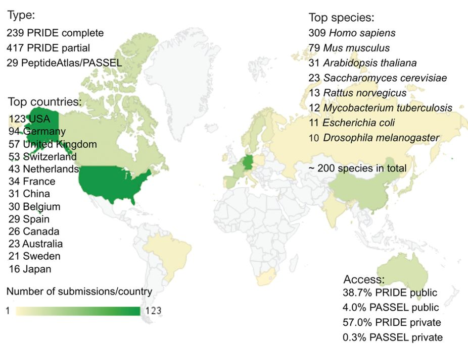
  
**Figure 22: Summary of the main metrics of ProteomeXchange submissions (as of February 2014).** ProteomeXchange started to accept regular submissions in June 2012. As of the beginning of February 2014, 685 ProteomeXchange data sets have been submitted (consisting of 656 tandem MS and 29 SRM data sets; Fig. 2), a total of $\sim$ 32 Tb of data. The largest submission so far (data sets PXD000320–PXD000324) comprised 5 Tb of data.  
<br />


<br />
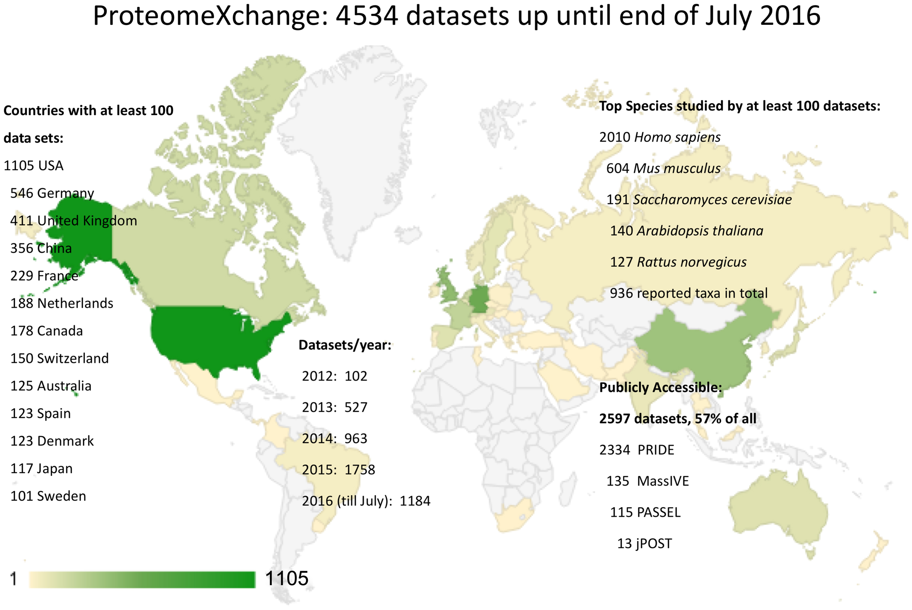
  
**Figure 23: Summary of the main metrics of ProteomeXchange submitted data sets (by the end of July 2016).** By the end of July 2016, a total of 4534 PX data sets had been submitted to any of the PX resources. In terms of individual resources, around 4067 data sets (representing 89.7% of all the data sets), had been submitted to PRIDE, followed by MassIVE (339 data sets), PASSEL (115 data sets) and jPOST (13 data sets, just joined PX at the beginning of July 2016). Data sets come from 50 countries, demonstrating the global reach of the consortium. The most represented countries are USA (1105 data sets), Germany (546), United Kingdom (411), China (356) and France (229). Since 2012, the number of submitted data sets has increased substantially every year, ranging from 102 (2012) to 1758 (2015).  
<br />


<br />
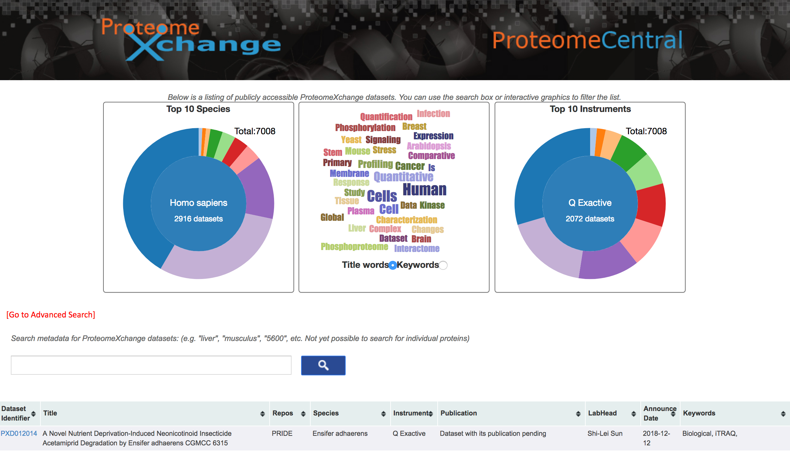

**Figure 24: A listing of publicly accessible ProteomeXchange datasets.**  
<br />


## Database Search

- [Mascot](http://www.matrixscience.com/) [@eng_approach_1994]
- [SEQUEST](http://proteomicsresource.washington.edu/protocols06/sequest.php) now [comet](http://comet-ms.sourceforge.net/) [@perkins_probability-based_1999]
- [MaxQuant/Andromeda](https://www.biochem.mpg.de/5111795/maxquant) [@cox_andromeda:_2011]


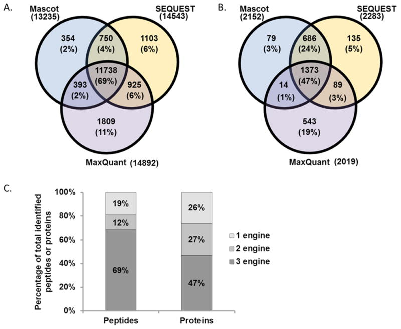
  
**Figure 25: Search engine comparison.** Venn diagrams comparing **A)** peptide identifications and **B)** protein identifications. **C)** Bar graph illustrating the redundancy of peptides and proteins identified by one, two, and three search engines. As a results, **Peptide overlap among the search engines was greater than that of proteins**.  


[Top](#Top)


<!-- # Components -->

<!-- * MS Data Parser -->
<!--     - *[mzR](https://bioconductor.org/packages/3.8/mzR)*: parser for netCDF, mzXML, mzData and mzML and mzIdentML files (mass spectrometry data) -->
<!-- * Isotopic Peak Detector -->
<!--     - *[IPPD](https://bioconductor.org/packages/3.8/IPPD)*: Isotopic peak pattern deconvolution for Protein Mass Spectrometry by template matching -->
<!-- * Peptide Identifier -->
<!--     - *[MSGFplus](https://bioconductor.org/packages/3.8/MSGFplus)*: An interface between R and MS-GF+ -->
<!--         + MS-GF+ is an increasingly popular algorithm that can automatic identification of peptides from LC-MS/MS experiments. -->
<!-- * Missing data Processor -->
<!--     - Censoring -->
<!--         + no censoring = no missing data -->
<!--         + left censoring = event of interest happened before enrollment -->
<!--         + right censoring = event of interest not happened during the enrollment -->
<!--     - Imputation -->
<!-- * Significance Analyzer -->
<!--     - [SASPECT: Significant AnalysiS of PEptide CounTs](https://cran.r-project.org/web/packages/SASPECT/index.html) -->


<!-- [Top](#Top) -->


<!-- # CRAN -->

<!-- * Collection -->
<!--     - [proteomics: Statistical Analysis of High Throughput Proteomics Data](https://cran.r-project.org/web/packages/proteomics/index.html) -->
<!--     - [protViz: Visualizing and Analyzing Mass Spectrometry Related Data in Proteomics](https://cran.r-project.org/web/packages/protViz/index.html) -->
<!--     - [deisotoper: Detection of Isotope Pattern of a Mass Spectrometric Measurement](https://cran.r-project.org/web/packages/deisotoper/index.html) -->
<!--     - [aLFQ: Estimating Absolute Protein Quantities from Label-Free LC-MS/MS Proteomics Data](https://cran.r-project.org/web/packages/aLFQ/index.html) -->
<!--     - [Cancer Classification Using Mass Spectrometry-based Proteomics Data](https://cran.r-project.org/web/packages/bst/vignettes/pros.pdf) -->
<!-- * Significant Analysis -->
<!--     - [SASPECT: Significant AnalysiS of PEptide CounTs](https://cran.r-project.org/web/packages/SASPECT/index.html) -->
<!--     - [SafeQuant: A Toolbox for the Analysis of Proteomics Data](https://cran.r-project.org/web/packages/SafeQuant/index.html) -->
<!-- * Missing Values -->
<!--     - [imp4p: Imputation for Proteomics](https://cran.r-project.org/web/packages/imp4p/index.html) -->
<!--     - [imputeLCMD: A collection of methods for left-censored missing data imputation](https://cran.rstudio.com/web/packages/imputeLCMD/index.html) -->

<!-- [Top](#Top) -->


<!-- # Bioconductor -->

<!-- * Workflow -->
<!--     - *[DEP](https://bioconductor.org/packages/3.8/DEP)* (v1.4.1) -->
<!--     - *[RforProteomics](https://bioconductor.org/packages/3.8/RforProteomics)* (v1.20.0) -->

<!-- [Top](#Top) -->


<!-- # Dataset -->

<!-- * Simulation -->
<!--     - [imputeLCMD::generate.ExpressionData()](https://github.com/cran/imputeLCMD/blob/master/man/generate.ExpressionData.Rd) -->
<!--         + generate peptide/protein expression data (log-transformed) as random draws from a multi- variate Gaussian distribution as well as a function to generate missing data (both randomly and non-randomly) -->
<!-- * MS Data -->
<!--     - *[msdata](https://bioconductor.org/packages/3.8/msdata)*: Various Mass Spectrometry raw data example files -->
<!--     - [SASPECT: data(mouseTissue)]() -->
<!--         + [@whiteaker_integrated_2007] -->
<!--         + It contains the information of 333 peptides from 20 LC-MS/MS experiments (10 from the normal group and 10 from the control group). -->

<!-- [Top](#Top) -->


# Miscellaneous

* Resource
    - [Protein Quantitation by Mass Spectrometry](https://www.slideshare.net/wittyaky/proteomics-mass-spectrometry-science-bioinformatics-electrophoresis-liquidchromatography-3ph-d-courseworkproteomicsclass21dec2012)
    - [Quantitative Proteomics @ Thermo Fisher](https://www.thermofisher.com/us/en/home/life-science/protein-biology/protein-biology-learning-center/protein-biology-resource-library/pierce-protein-methods/quantitative-proteomics.html)
* Papers  
    - Using R and Bioconductor for proteomics data analysis [@gatto_using_2014]
    - Visualization of proteomics data using R and Bioconductor [@noauthor_visualization_nodate]
    - Quantitative mass spectrometry in proteomics: a critical review [@bantscheff_quantitative_2007]
    - Quantitative mass spectrometry in proteomics: critical review update from 2007 to the present [@bantscheff_quantitative_2012]
    - Dissecting the iTRAQ Data Analysis [@aggarwal_dissecting_2016]
<!-- * Meetings -->
<!--     -  -->
<!-- * Blogs -->
<!--     -  -->

[Top](#Top)


# Session information


<!-- \blandscape -->

```
## R version 3.5.1 (2018-07-02)
## Platform: x86_64-apple-darwin15.6.0 (64-bit)
## Running under: macOS High Sierra 10.13.6
## 
## Matrix products: default
## BLAS: /Library/Frameworks/R.framework/Versions/3.5/Resources/lib/libRblas.0.dylib
## LAPACK: /Library/Frameworks/R.framework/Versions/3.5/Resources/lib/libRlapack.dylib
## 
## locale:
## [1] en_US.UTF-8/en_US.UTF-8/en_US.UTF-8/C/en_US.UTF-8/en_US.UTF-8
## 
## attached base packages:
## [1] grid      stats     graphics  grDevices utils     datasets  methods  
## [8] base     
## 
## other attached packages:
## [1] captioner_2.2.3.9000 dplyr_0.7.99.9000    png_0.1-7           
## [4] kableExtra_0.9.0     knitr_1.20           BiocStyle_2.10.0    
## 
## loaded via a namespace (and not attached):
##  [1] Rcpp_1.0.0          highr_0.7           pillar_1.3.0       
##  [4] compiler_3.5.1      BiocManager_1.30.4  tools_3.5.1        
##  [7] digest_0.6.18       evaluate_0.12       tibble_1.4.2       
## [10] viridisLite_0.3.0   pkgconfig_2.0.2     rlang_0.3.0.1      
## [13] rstudioapi_0.8      yaml_2.2.0          xfun_0.4           
## [16] stringr_1.3.1       httr_1.3.1          xml2_1.2.0         
## [19] hms_0.4.2           tidyselect_0.2.5    rprojroot_1.3-2    
## [22] glue_1.3.0          R6_2.3.0            rmarkdown_1.10     
## [25] bookdown_0.8        purrr_0.2.5         readr_1.2.1        
## [28] magrittr_1.5.0.9000 backports_1.1.2     scales_1.0.0       
## [31] htmltools_0.3.6     assertthat_0.2.0    rvest_0.3.2        
## [34] colorspace_1.3-2    stringi_1.2.4       munsell_0.5.0      
## [37] crayon_1.3.4
```
<!-- \elandscape -->


[Top](#Top)


# <a name="Ref"/> Reference {#Ref}


